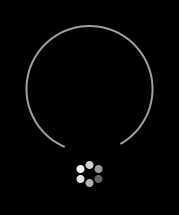

# Loading indicators written in SwiftUI

The best part of using components made in SwiftUI is that they work on all Apple platforms. ❤️ This means that these loading indicators work great on:
- iOS 📱
- watchOS ⌚️
- tvOS 📺
- macOS 🖥

## Preview

## Made by
- [JagCesar](https://github.com/jagcesar)
- [Westerlund](https://github.com/westerlund)
