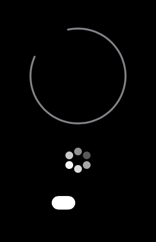

# Espera

Espera is loading indicators written in Swift UI. For now there are only two of them, a rotating circle with a gap (you've seen it on the App Store) and the rotating flower you've seen on watchOS.

These two components aren't part of UIKit or watchKit so we decided to create them and make them available to you.

The best part of using components made in SwiftUI is that they work on all Apple platforms. ❤️ This means that these loading indicators work great on:
- iOS 📱
- watchOS ⌚️
- tvOS 📺
- macOS 🖥

## Preview

## How do I use this?

The best way to use this code is to add it as a Swift Package to your Xcode project. [Follow the instructions by Apple](https://developer.apple.com/documentation/xcode/adding_package_dependencies_to_your_app) to quickly get started.

## Made by
- [JagCesar](https://github.com/jagcesar)
- [Westerlund](https://github.com/westerlund)
